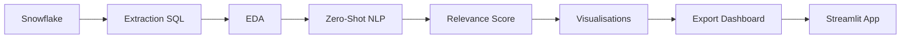

# Step 4: Case Study - Data Analysis

## 📋 Vue d'Ensemble

Ce dossier contient le **Jupyter Notebook principal** pour l'analyse et la catégorisation des avis utilisateurs Amazon via des algorithmes NLP (Natural Language Processing).

**Objectif** : Développer un système automatisé de classification thématique et de scoring de pertinence des reviews.

---

## 📁 Structure du Projet

```
project_2/
│
├── notebooks/
│   ├── step_4_case_study/
│   │   ├── Step_4_Case_Study_Analysis.ipynb    ⭐ Notebook principal
│   │   └── README.md                           📄 Ce fichier
│   │
│   └── sql_queries/                            📂 Requêtes SQL Snowflake
│       ├── 01_data_extraction.sql              → Extraction des données
│       ├── 02_data_aggregation.sql             → Agrégations pour dashboard
│       └── 03_advanced_analysis.sql            → Analyses avancées
│
├── data/outputs/
│   ├── visualizations/                         📊 Graphiques générés
│   │   ├── 04_eda_stats_generales.png
│   │   ├── 04_eda_stats_par_rating.png
│   │   ├── 07_confidence_distribution.png
│   │   ├── 09_relevance_distribution.png
│   │   ├── 10_category_rating_heatmap.html
│   │   └── 10_wordclouds_by_category.png
│   │
│   ├── models/                                 🤖 Modèles entraînés (futurs)
│   └── processed/                              💾 Données préparées
│       ├── reviews_analyzed.parquet
│       ├── category_stats.csv
│       └── top_reviews.csv
│
├── dashboards/                                 🎨 Application Streamlit
│   ├── streamlit_app.py                        → App principale
│   ├── pages/                                  → Pages multi-pages
│   ├── components/                             → Composants réutilisables
│   └── utils/                                  → Utilitaires (DB, processing)
│
└── docs/
    ├── step_4_analysis_report.md               📄 Rapport final (5-10 pages)
    └── figures/                                → Figures pour le rapport
```

---

## 🚀 Démarrage Rapide

### 1. Prérequis

```bash
# Installer les dépendances Python
pip install snowflake-connector-python
pip install transformers torch
pip install nltk pandas numpy matplotlib seaborn plotly
```

### 2. Configuration Snowflake

Mettre à jour les credentials dans le notebook (Section 2.3) :

```python
conn_params = {
    'account': 'YOUR_ACCOUNT',
    'user': 'YOUR_USER',
    'password': 'YOUR_PASSWORD',
    'warehouse': 'YOUR_WAREHOUSE',
    'database': 'YOUR_DATABASE',
    'schema': 'YOUR_SCHEMA'
}
```

### 3. Exécution

1. Ouvrir `Step_4_Case_Study_Analysis.ipynb` dans Jupyter/VS Code
2. Exécuter les cellules séquentiellement (Shift+Enter)
3. Suivre les instructions dans chaque section

---

## 📊 Contenu du Notebook

### Section 1 : Introduction & Contexte
- Problématique business
- Objectifs de l'analyse
- Questions de recherche

### Section 2 : Configuration & Connexion
- Installation des dépendances
- Import des bibliothèques
- Connexion à Snowflake

### Section 3 : Extraction des Données
- Sélection du produit échantillon
- Extraction des reviews depuis Snowflake
- Nettoyage des données

### Section 4 : Analyse Exploratoire (EDA)
- Statistiques descriptives
- Visualisations (ratings, longueur, images)
- Insights clés

### Section 5 : Choix de l'Algorithme
- Comparaison des approches NLP
- Justification du choix (Zero-Shot Classification)
- Définition des catégories métier

### Section 6 : Implémentation NLP
- Initialisation du modèle (BART/mDeBERTa)
- Fonction de classification
- Application sur l'échantillon

### Section 7 : Vérification & Performance
- Métriques de convergence
- Confidence score distribution
- Validation manuelle

### Section 8 : Tests Itératifs
- Expérimentation 1 : Regroupement de catégories
- Expérimentation 2 : Filtrage des reviews courtes
- Expérimentation 3 : Comparaison de modèles

### Section 9 : Relevance Score
- Formule multi-critères (5 composantes)
- Calcul des sous-scores
- Distribution et classification

### Section 10 : Visualisations & Insights
- Heatmap catégories vs ratings
- Top reviews pertinentes
- Word clouds par catégorie
- Insights métier

### Section 11 : Préparation Dashboard
- Agrégations pour Streamlit
- Export vers Snowflake/fichiers locaux
- Structure du dashboard

### Section 12 : Limitations & Recommandations
- Limitations identifiées
- Roadmap d'amélioration (court/moyen/long terme)
- Métriques de succès

### Section 13 : Livrables & Export
- Checklist de complétion
- Export du rapport final
- Documentation

---

## 🎯 Algorithme de Classification

### Zero-Shot Classification

**Modèle** : `facebook/bart-large-mnli` (ou `mDeBERTa-v3` pour multilingue)

**Catégories métier** :
1. **Product Quality or Satisfaction** : Qualité, performance, satisfaction
2. **Product Defect or Damaged Item** : Défauts, problèmes, dommages
3. **Delivery Issue or Shipping Delay** : Livraison, délais, packaging
4. **Customer Service or Support** : SAV, remboursement, support

**Avantages** :
- Pas de labeling manuel requis
- Flexibilité (ajustement des catégories sans ré-entraînement)
- Performance acceptable (70-85%)

---

## 📈 Relevance Score

### Formule

```python
relevance_score = (
    0.25 × text_length_score      # Gaussienne centrée sur 300 caractères
  + 0.20 × has_image              # Présence d'image (0 ou 1)
  + 0.15 × has_orders             # Achat vérifié (0 ou 1)
  + 0.15 × is_extreme_rating      # Rating 1★ ou 5★ (0 ou 1)
  + 0.25 × sentiment_score        # VADER sentiment (0-1)
) × 100
```

**Échelle** : 0-100 (plus élevé = plus pertinent)

**Seuil de pertinence** : 80/100 (identifie le top 15-20% des reviews)

---

## 📦 Livrables

### ✅ Fichiers générés par le notebook

1. **Visualisations** (8 graphiques) :
   - `data/outputs/visualizations/*.png|html`

2. **Données préparées** :
   - `data/outputs/processed/reviews_analyzed.parquet` (dataset complet)
   - `data/outputs/processed/category_stats.csv` (statistiques par catégorie)
   - `data/outputs/processed/top_reviews.csv` (reviews pertinentes)

3. **SQL Queries** (3 fichiers) :
   - `notebooks/sql_queries/01_data_extraction.sql`
   - `notebooks/sql_queries/02_data_aggregation.sql`
   - `notebooks/sql_queries/03_advanced_analysis.sql`

4. **Rapport d'analyse** (à générer) :
   - `docs/step_4_analysis_report.md` (5-10 pages)

5. **Dashboard Streamlit** (à développer) :
   - `dashboards/streamlit_app.py`

---

## 🛠️ Technologies Utilisées

| Technologie | Usage | Version |
|-------------|-------|---------|
| **Python** | Langage principal | 3.11+ |
| **Snowflake** | Data warehouse | - |
| **Transformers (Hugging Face)** | Modèles NLP | 4.30+ |
| **PyTorch** | Backend ML | 2.0+ |
| **NLTK** | Sentiment analysis (VADER) | 3.8+ |
| **Pandas** | Manipulation de données | 2.0+ |
| **Matplotlib/Seaborn** | Visualisations statiques | - |
| **Plotly** | Visualisations interactives | 5.0+ |
| **Streamlit** | Dashboard (futur) | 1.30+ |

---

## 🔄 Workflow d'Exécution



**Temps estimé** : 30-60 minutes (selon volume de données et GPU)

---

## ⚠️ Limitations & Améliorations

### Limitations actuelles

1. **Échantillon unique** : Analyse limitée à 1 produit
2. **Modèle non fine-tuné** : Précision ~75% (vs 90%+ possible)
3. **Pas de détection de spam** : Reviews fake non filtrées
4. **Scalabilité** : Temps d'inférence élevé sur CPU

### Roadmap d'amélioration

**Court terme** :
- [ ] Validation sur dataset labellisé (500-1000 reviews)
- [ ] Extension à 10-20 produits de catégories variées
- [ ] Optimisation du seuil de relevance_score

**Moyen terme** :
- [ ] Fine-tuning du modèle BART
- [ ] Détection de spam avancée
- [ ] Pipeline automatisé (Airflow)

**Long terme** :
- [ ] Modèle custom multi-tâches
- [ ] A/B Testing impact business
- [ ] API temps réel (FastAPI)

---

## 📚 Ressources & Références

### Documentation officielle
- [Hugging Face - Zero-Shot Classification](https://huggingface.co/tasks/zero-shot-classification)
- [VADER Sentiment Analysis](https://github.com/cjhutto/vaderSentiment)
- [Snowflake Python Connector](https://docs.snowflake.com/en/user-guide/python-connector)
- [Streamlit Documentation](https://docs.streamlit.io)

### Papers
- [BART: Denoising Sequence-to-Sequence Pre-training](https://arxiv.org/abs/1910.13461)
- [DeBERTa: Decoding-enhanced BERT with Disentangled Attention](https://arxiv.org/abs/2006.03654)

### Modèles utilisés
- [facebook/bart-large-mnli](https://huggingface.co/facebook/bart-large-mnli)
- [MoritzLaurer/mDeBERTa-v3-base-xnli-multilingual-nli-2mil7](https://huggingface.co/MoritzLaurer/mDeBERTa-v3-base-xnli-multilingual-nli-2mil7)

---

## 🤝 Support & Contact

Pour toute question sur ce case study :

1. **Consulter le notebook** : Commentaires détaillés dans chaque cellule
2. **Vérifier les SQL queries** : `/notebooks/sql_queries/`
3. **Examiner les visualisations** : `/data/outputs/visualizations/`
4. **Lire le rapport final** : `/docs/step_4_analysis_report.md` (après génération)

---

## ✅ Checklist de Complétion

- [ ] Connexion Snowflake fonctionnelle
- [ ] Extraction des données complète
- [ ] EDA avec visualisations sauvegardées
- [ ] Modèle NLP implémenté et testé
- [ ] Relevance score calculé
- [ ] Visualisations finales exportées
- [ ] Données sauvegardées (Snowflake + local)
- [ ] Dashboard Streamlit développé
- [ ] Rapport final généré (5-10 pages)

---

**Dernière mise à jour** : 2025-11-03
**Version** : 1.0
**Status** : Structure créée, prêt pour exécution
